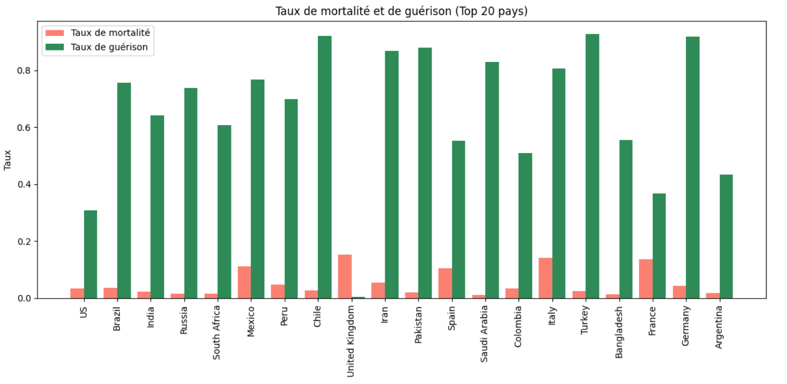
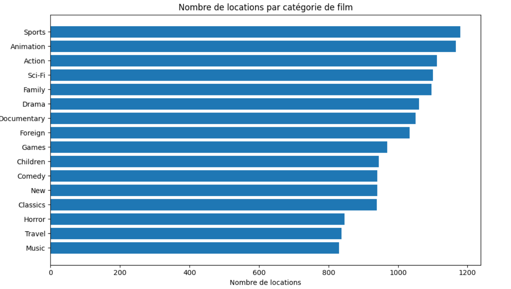
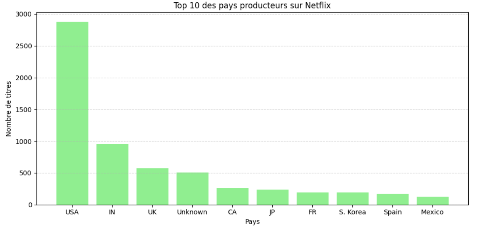
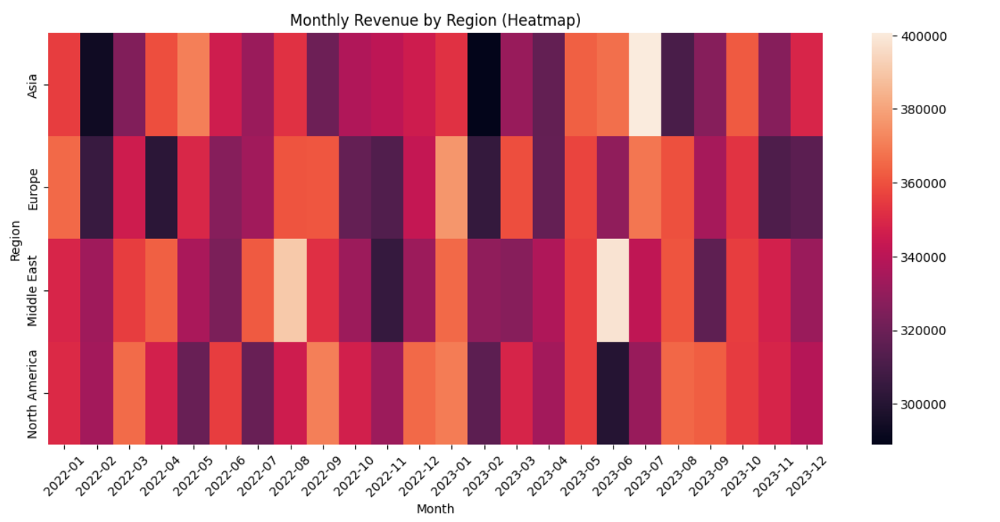

<link rel="stylesheet" href="style.css">

1️⃣ Accueil (Hero section)

GOMA NKALA Odysseas
Data Analyst

Data analyst en début de carrière, je développe mes compétences en analyse et visualisation de données afin de transformer les données en insights utiles à la prise de décision.

2️⃣ À propos de moi

Bonjour,

Je suis Odysseas GOMA NKALA, titulaire d’un Master en Marketing International. Au cours de mon parcours, j’ai progressivement orienté mes compétences vers l’analyse de données et la performance business.

Mon expérience en SEO, analyse de verbatims clients et optimisation de contenus m’a permis de transformer des données utilisateurs en recommandations stratégiques concrètes.

Aujourd’hui, je développe mes compétences en Python, SQL et data visualisation afin de concevoir des analyses plus avancées et soutenir une prise de décision basée sur les données.

💡 Mon objectif : utiliser l’analyse de données pour identifier des tendances, générer des insights et soutenir la prise de décision..

3️⃣ Compétences

Data Analysis

Python

SQL

Pandas

Numpy

Data Visualization

Power BI

Matplotlib

Seaborn

Data & Analytics Tools

Excel

Google Analytics

Google Search Console

SEMrush / Ahrefs

Gestion de projet

Jira

Trello

Méthodes Agile

📂 Projets Data
📊 Analyse des données e-commerce

🔗 Liste analyse de données :

COVID-19 Data Analysis [Voir l'analyse](https://github.com/Odysseas18/GOMA-Project/blob/main/Exercice%20Covid.ipynb)

Analyse exploratoire de données sur la pandémie de COVID-19 afin d'étudier l'évolution des cas, décès et guérisons à l'échelle mondiale.

Technologies : Python, Pandas, Matplotlib, Seaborn, Plotly

🎬 Analyse cinématographique: [Voir l'analyse](https://github.com/Odysseas18/GOMA-Project/blob/main/Analyse%20cin%C3%A9matographique.ipynb)

Exploration d’un dataset de films afin d’identifier les tendances du secteur cinématographique et les caractéristiques des films populaires.

Technologies : Python, Pandas, Matplotlib, Seaborn

🎥 Analyse du catalogue Netflix : [Voir l'analyse](https://github.com/Odysseas18/GOMA-Project/blob/main/Analyse%20Netflix.ipynb)
Analyse du catalogue Netflix afin d’identifier les tendances de contenu, les genres dominants et la distribution des films et séries.

Technologies : Python, Pandas, Matplotlib, Seaborn

🏅 Web Scraping – Jeux Olympiques : [Voir l'analyse](https://github.com/Odysseas18/GOMA-Project/blob/main/Scrapping%20donn%C3%A9es%20JO.ipynb)

Collecte automatisée de données à partir du web afin de construire un dataset sur les Jeux Olympiques.

Technologies : Python, BeautifulSoup, Requests, Pandas

🛒 Analyse des ventes Amazon – Exploration et visualisation des données [Voir l'analyse](https://github.com/Odysseas18/GOMA-Project/blob/main/notebookamazon.ipynb)

Dans ce projet, j’ai réalisé une analyse exploratoire d’un dataset de ventes Amazon afin d’identifier les tendances de performance commerciale selon les régions et les périodes.

L’objectif était de transformer des données brutes en indicateurs exploitables permettant de mieux comprendre la dynamique des ventes.

💼 Expérience
Orange — Chargée de Marketing Digital / Voix du Client

Analyse de verbatims utilisateurs pour améliorer l’expérience des applications

Analyse SEO et performances de recherche

Création de rapports et dashboards Excel pour le suivi des KPIs

Lamy Liaisons — Chargée de Marketing

Gestion de campagnes marketing

Création de contenus et animation des réseaux sociaux

Reporting et analyse des données marketing

🎓 Formation

📊 Bootcamp Data Analyst

🎓 Master Marketing International — ESCE Business School

🎓 Licence Langues Étrangères Appliquées — Université de Reims

📚 Formation complémentaire
Python & SQL pour l’analyse de données

🌍 Langues

🇫🇷 Français — langue maternelle
🇬🇧 Anglais — B2
🇪🇸 Espagnol — B2
🇵🇹 Portugais — notions

📫 Contact
📧 odysseas.gomankala@gmail.com

